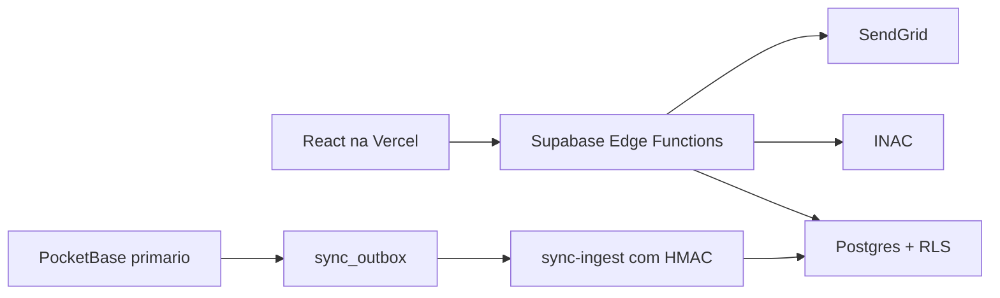

# Adapta Summit 2026 Check-in Fallback

Hot standby do check-in do Adapta Summit 2026. O frontend preserva as rotas e
a experiencia do sistema original, mas todo o runtime deste repositorio usa
Supabase.

## Escopo do v1

- Login do comprador por magic link e token proprio.
- Listagem, convite e visualizacao de ingressos.
- Formulario do participante, QR code e integracao INAC.
- Helpdesk com chave compartilhada e operador auditado.
- Supabase Auth para administradores.
- Dashboard, compradores, participantes, logs e operacoes essenciais.
- Importacao inicial, outbox HMAC, reconciliacao e ativacao de failover.

Campanhas, Guru, API externa, cortesias, importacao operacional e reconciliacao
de pedidos nao fazem parte do v1.

## Arquitetura



O navegador nao recebe `service_role` e nao acessa tabelas diretamente. Todas
as operacoes passam por `public-api`, `buyer-api`, `helpdesk-api` ou
`admin-api`.

## Desenvolvimento local

Requisitos: Node.js 24, pnpm 10 e Docker Desktop.

```bash
pnpm install --frozen-lockfile
pnpm supabase:start
pnpm supabase:types
pnpm dev
```

Crie `.env.local` a partir de `.env.example` e use os valores de
`supabase status -o env`. Para Functions, crie `supabase/.env.local` a partir
de `supabase/.env.example`.

## Validacao

```bash
pnpm build
pnpm lint
pnpm test
pnpm supabase:test
node --env-file=.env.load-full.local scripts/load-test.mjs
```

Os schemas declarativos em `supabase/schemas` sao a fonte de verdade. Depois de
alterar um schema, gere a migration com `supabase db diff -f <nome>` e valide
com `supabase db reset`.

## Deploy

Projeto Supabase: `idiagqbfmvyoywyjfufe`.

```bash
supabase login
supabase link --project-ref idiagqbfmvyoywyjfufe
supabase db push
supabase functions deploy public-api
supabase functions deploy buyer-api
supabase functions deploy helpdesk-api
supabase functions deploy admin-api
supabase functions deploy sync-ingest
```

Configure os secrets listados em `supabase/.env.example` com
`supabase secrets set`. Na Vercel, configure apenas
`VITE_SUPABASE_URL`, `VITE_SUPABASE_PUBLISHABLE_KEY` e `VITE_APP_URL`.

Crie o usuario administrativo no Supabase Auth e associe-o sem senha padrao:

```sql
insert into public.admin_profiles (user_id, display_name, role)
values ('<auth-user-id>', '<nome>', 'admin');
```

## Operacao

- [Arquitetura e seguranca](docs/architecture.md)
- [Runbook de failover](docs/failover-runbook.md)
- [Relatorio de testes](docs/test-report-2026-07-28.md)
- [Pacote do PocketBase primario](integrations/pocketbase-primary/README.md)
